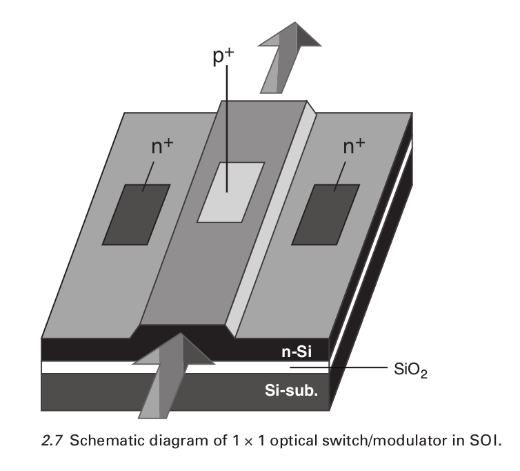

# Wikipedia: Optical switch
Ein optischer Schalter ist ein Gerät, dass selektiv optische Signale an/aus oder von einem Kanal zu einm anderem schaltet. Der erstgenannte wird als ein optischer (Zeit-Domäne) Schalter oder ein optischer Modulator, während der letztgenannte als ein optischer Raum-Schalter oder einen optischer Router bezeichnet wird. 

## Applications 
Die Technologie des optical switching wird von dem Bedarf an Felxibilität in optischen Netzwerken angetrieben. Führende Anwendugen sind optische Abschirmung, Testsysteme, fern-rekonfigurierbare add-drop Multiplexer und Sensorik.

*Multiplexverfahren (lat. multiplex vielfach, vielfältig) sind Methoden zur Signal- und Nachrichtenübertragung, bei denen mehrere Signale zusammengefasst (gebündelt) und simultan über ein Medium (Leitung, Kabel oder Funkstrecke) übertragen werden. Oftmals werden Multiplexverfahren auch kombiniert, um eine noch höhere Nutzung zu erreichen. Die Bündelung erfolgt, nachdem die Nutzdaten auf ein Trägersignal moduliert wurden. Entsprechend werden sie beim Empfänger nach der Entbündelung (dem Demultiplexen) demoduliert.*

*Ein Add-Drop-Multiplexer ist ein Gerät der Multiplextechnik, das einem Multiplexsignal sowohl ein oder mehrere Teilsignale hinzufügen (add) und auch aus dem Multiplexsignal Teilsignale entnehmen (drop) kann. Das empfangene Multiplexsignal wird bis auf diese Add/Drop-Änderungen unverändert weitergesendet.*

Aktuelle Anwendungen sind zB:

+ passiver Schutz-Schalten für wiederherstellung des Service nach ein Störung, zB einem  Bruch in einer Faser 
+ Remote Fiber Test Systems (RFTS) spührt und lokalisiert eine Störung innerhalb des Glasfaserkabels.

Aufstrebende Technik ist optical cross-connection. Also eine Kopplung zwischen mehreren optischen Imputs und Outputs.

---

#Optical switches - Materials and design
##Introduction to optical switches
Eine Glasfaser hat eine Bandbreite von $\SI{25000}{\GHz}$ und ein Kabel das 1000 dieser Fasern enthält kann bis zu sechs billionen Videotelefonate gleichzeitig übertragen, also ein Telefonat für jeden Menschen auf der Erde.
Mit den Techniken wie zB HDTV und 3D-Kino zu Hause, braucht es den Netzausbau und dieser ist nur mit Glasfaser zu bewerkstelligen unter verwendung von Halbleiterlasern. 
Deshalb müssen optische Bauteile für ein optisches Netzwerk gebaut werden. 
Allgemein ist ein Schalter dafür zuständig eine Umelitung eines Signals aufgrund eins Steuersignals durchzuführen. 
Das Signal kann dabei Multiplex-Verkehr oder auch eine große Anzahl von bit Kanälen sein. 
Die Anwendung von optischen Schaltern ist nicht nur limitiert auf Kommunikationsnetzwerke sondern könnten auch in Zukunft in großen multi-Prozessor Computern verwendet werden, deren Datenrate größer als 100Gbit/s.
Für Quantencomputing müssen noch Schalter entwickelt werden, die nicht die Phaseninformation stören.  

Ein optischer Schalter schaltet/leitet selektiv ein optisches Signal einer optischen Faser oder eines optischen Schaltkreis zu einem anderem.
Verschiedene Methoden durch verschiedene physikalische Mechanismen. 

**Elektro-optischer Schalter:**
Verminderung des Brechungsindexes durch anlegen einer Spannung an einem Halbleiter ermöglicht es zu Schalten. 
Wird eine Oberfläche des Materials Ladugsträger angebracht, kommt es dazu, dass der Brechungsindex einer Seite des MAterials reduziert wird, dass führt dazu das die Seiten des Materials unterschiedliche Brechungsindizies besitzen, was wiederum zu totaler inneren Reflexion führt. 
Das führt schließlich dazu, dass ein einfallender Strahl ehr reflektiert wird als an der OF transmittiert wird. 
Das kann verwendet werden um den Strahl zu schalten. 
Änderung des Brechungsindexes eines Strahlengangs zu einem anderen führt zur Interferenz, diese kann konstruktiv bzw destruktiv sein, wenn beide Strahlengänge sich treffen. 
Elektro-optische Schalter machen sich genau das zur Nutze in einem interferometrischen Apparat.

**Thermo-optischer Schalter:**
Der Brechungsindex kann mit Temperatur beeinflusst werden. 
Brechungsindizes von Materialien nehmen ab mit ansteigender Temperatur. 
In einem interferometrischen Apparat kann so ein SChalter ermöglicht werden. 

**Magneto-Optischer Schalter:**
Die Polarisation des Lichtes kann geändert werden, wenn es durch ein Medium durchgeht das mit einem Magnetfeild wechselwirkt. 
Die Rotation der Polarisationsebene ist bekannt als Faraday-Effekt, ist proportional zur Intensitiät des angelegten Magnetfeldes in Richtung des Lichtstrahls. Mit einem Polarisator am Ende des Mediums, kann der Strahl dann abgeschnitten werden. 

**MEMS Schalter:**
Wird ein Strahl an einem micro-Spiegel reflektiert, kann der reflektierte Strahl auf eine Anzahl an optischen Fasern präzise über die Auslenkung des Spiegels gelengt werden. 
Diese Spiegel können zu sog. micro-electro-mechanical (MEMS) systems eingebaut werden. 
Das wird oft bewerkstelligt in dem eine Si-OF in kleine arrays von flachen Balken oder Membranen geäzt wird. 
Die Bewegung dieser Spiegel bildet dann die Basis der auf MEMS-basierenden optischen Schalter.

**semiconductor optical amplifier (SOA) Schalter:**
Propagiert Licht durch ein Aktives Laser Medium, kann sich dessen Wellenlänge, Polarisation, Phase und Amplitude ändern, dabei kann dann durch ein Element, dass sensitiv auf die Eigenschaft reagiert die durch die Anregung verändert wurde, eine (gating function) Ein-/Ausblende Funktion erzeugt/erhalten werden. 
Bsp (grating polarization beam splitter) Pol Beam Splitter während ein Mach-Zehnder Interfero nach Wellenlänge, Polarisation und Phase selektieren kann. 
Das Eibinden eines Halbleiter optischen Verstärkers (SOA) formt die Basis des SOA SSchalters

**Schalten mit nichtlinearen Effekten:**
Mit dem nichtlinearen Kerr Effekt kann der Brechungsindex eines Materials durch anlegen eines elektrischen Feldes verändert werden.
Im Falle das das Licht selbst das E-Feld dastellt, handelt es sich um den optischen Kerr Effekt. 
Dieser ändert den Brechungsindex proportional zur lokalen Strahlungsintensität/-dichte des Lichtes. 
Dieser Brechungsindex ist verantwörtlich für die Effekte des Selbst-Fokusierens und Selbst-Phasen Modulation. 
Der Strahl der durch ein Medium propagiert, erfährt einen Phasenverschub aufgrund des sich ändernen Brechungsindizies, der durch die Intensität des Strahls hervorgerufen wird. 
Wird hierbei noch ein Ein-/Ausblendendes Element (gating) Element verwendet, kann eine Schaltung verwirklicht werden. 

**Flüssigkristall Schalter:**
In Flüssigkristallen ändert die Orientirung der Stab-ähnlichen Moleküle die Polarisierung eines linear pol Strahls, der durch das Medium propagiert. 
Wird die Orientierung der Moleküle kontinuierlich von Anfang bis Ende einer Lage bis $\SI{90}{\degree}$ variiert, durch anlegen einer Spannung, kann die Polarisationsebene des Lichtes um $\SI{90}{\degree}$ gedreht werden, im Vgl zum Input. 
Mit einem Polarisatior kann am Ende das Flüssigkristall, kann dann ein Schalter verwirklicht werden. 
Spannung an kommt durch, Spannung aus nicht.

**Schalter basieren auf photonischen Kristallen:**
photonische Kristalle sind periodische optische Nanokristalle, typisch hexagonal angeordnete arrays auf Löchern in einem flachen Hohlleiter/Wellenleiter (waveguide), so hergestellt, dass sie den selben Effekt auf Photonen wie die Periodizität von Halbleiterkristallen auf Elektronen hat. 
Bei richtiger Wahl des Loch Durchmessers und Periode, können spezifische Wellenlängen nicht durch das Material propagieren. 
Auf diese WEise kann durch entfernen einer solchen Reihe, kann das Licht durch diese Reihe hindurch propagieren, wo keine Löcher sind. 
Durch Änderung des Brechungsindexes des Halbleiter durch den das Licht propagiert, zB durch einen Kontrollpuls, kann ein Phasenverschub auftreten. Durch die Phasenänderung kann dann die Basis des Schalters bilden. 

**Faser-Schalter:** 
Physikalisches hin und her bewegen von zwei Phasern die jeweils von einem Piezoelement aufgebracht sind und so bewegt werden können. 
Bei richtiger Ausrichtung findet Transmission statt und es kann zwischen den Fasern geschaltetet werden. 

**Quanten optisscher Schalter:**
Bei dem Quantum confined stark effect beschreibt die Änderung eine quantisierten Energie in einem Quantentopf wenn ein el Feld über den Quantentopf gelegt wird. 
Daraus resultiert eine reduktion der Übergangsenergie zwischen dem geringsten quantisierten Energieniveau von LOch und Elektron. 
Die optische Absorption ist des Quantentopfes ist erhöht für eine bestimmte Wellenlänge bei Anschluss eine Spannung.

## Electro-optical switches
###Theory and principles of electro-optical switches

{ height=40% }

### Device structures of electro-optical switches

{ height=40% }

1x1 optischer Schalter = 1x1 optischer Modulator. (1x1 = einer rein , einer raus) 
Wird mit III-V Materialen hergestellt, Bsp Si(Ge), $LiNbO_3$ oder Polymeren.
Wird ie zB im Bild als SOI hergestellt also Silizium auf einem Isolator (SOI). 
Besteht aus einer einzel Moden Lamelle die als einzel Moden-Wellenleite dient, diese besteht aus einem n-typ (n-dotiert) Silizium auf einer $Si0_2$ Lage. 
Eine p-n-Zusammenfügung wird unter der OF der Lamelle erstellt, um dort Ladungsträger in den Wellenleiter einzubringen. 
Wird der p-n-Übergang in Vorwärtsrichtung betrieben, wenn optische Signale in die Lamelle entkuppelt werden, kann eine große Zahl von Ladungsträgern in den Wellenleiter eingebracht werden, dass führt dazu das der Brechungsindexes sich verringern wird. 
Das kann dazu führen, dass der leitende Modus in den Strahlungsmodus des Substrates und der Hülle übergeht. 
*Für Wellenleiter heißt das ein Strahlendermodus der nicht nur auf den Kern zB einer Faser begrenzt ist. Dieser Modus hat Felder, die überall außerhalb des Leiters oszillieren.*
Das führt dazu das viel Energie des leitenden Modus verloren geht und in der Lamelle absorbiert wird. 
Das führt dazu, dass die Lamelle den Strahl abschneidet. 
$n^+$ zeigen Kollektoren an.
Die Modulationstiefe (relative Modulations Amplitude / max. Änderung in Absorption) von $\SI{96}{\percent}$ bei $\SI{45}{\milli\ampere}$ (was auch der Betriebsstrom ist). 
Der Verlust beim einstrahlen liegt bei $\SI{3.65}{\decibel}$ bei einer Wellenlänge von $\SI{1.3}{\micro\meter}$.
Schlatzeit liegt bei $\SI{160}{\nano\second}$.

+ funkt so, dass durch anlegen eines Feldes ein ein Strahlungsmodus erreicht werden kann. Der kommt durch die reflexion innerhalb des LEiters durch die Änderung des Brechungsindexes. 
+ Dieser Strahlungsmodus hat Einfluss auf die Propagationskonstante des Materials $\gamma = \alpha + i \beta$. Dadurch wird $\beta$ verändert. Das ist der Parameter für die Phase, weshalb man hier auch von Phasenmodulation sprechen könnte. 

## Liquid crystal optical switches
### Liquid crystal theory and principles
Einige organische Stoffe besitzen eine gewisse molekulare Ordnung abhängig von der Temperatur (sog. thermooptische Flüssigkristalle [LC]), also ein Mittelding zwischen kristallinen Stoffen und amorphen Flüssigkeiten.
Manche Eigenschaften der Flüssigkristalle sind anisotrop wie zB die dielektrische Konstante und der Brechungsindex, wie auch bei manchen Festkörpern, sie sind aber gleichzeitig flüssig wie normale Flüssigkeiten. 
Das hat zur Folge, dass die optischen Eigenschaften sich leicht durch anlegen eines el Feldes kotrollieren lassen. 
Grundlegen basieren LC-Bauteile aus einer dünnen Schicht eines LC-Materials zwischen zwei Glassubstraten.

{ height=30% }

